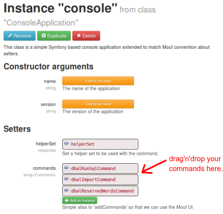

[](https://packagist.org/packages/mouf/utils.console)
[](https://packagist.org/packages/mouf/utils.console)
[](https://packagist.org/packages/mouf/utils.console)

Console for Mouf PHP framework
==============================

This is a simple [Symfony 2 based console](http://symfony.com/doc/current/components/console/introduction.html) for the [Mouf PHP framework](http://mouf-php.com).

Why?
----

Mouf is a graphical framework, so most of the development is done in the UI.
However, it can sometimes be useful to have a command line interface, to use in
deploy scripts or on remote servers... This package provides this command-line.

How does it work?
-----------------

Simply include this package in your `composer.json` requirements:

```json
{
    "require": {
        "mouf/utils.console": "~1.0"
    }
}
```

The command line will be accessible from `vendor/bin/mouf_console`

Adding your own command
-----------------------

In order to add a new command to the list of available commands, 
you must [create a new class extending the `Command` class](http://symfony.com/doc/current/components/console/introduction.html#creating-a-basic-command).

Then, you should create an instance of the class in Mouf user interface.

Finally, the console application is represented by the `console` instance in Mouf.
Edit this instance, and drag'n'drop your command in the list of known commands:



Package developers
------------------

Most of what you need to know is detailed in [Symfony's doc](http://symfony.com/doc/current/components/console/introduction.html).

In order to create a new command and register it automatically when you package is installed, you should:

- create [an install script for your package](http://mouf-php.com/packages/mouf/mouf/doc/install_process.md)
- create an instance of the command in this installation script
- register this command using `ConsoleUtils::registerCommand($command)`

Here is a sample script you could put in your install script:

```php
use Mouf\Actions\InstallUtils;
use Mouf\Console\ConsoleUtils;
use Mouf\MoufManager;

...
// Let's create an instance of "ConsoleUtils"
$consoleUtils = new ConsoleUtils($moufManager);

// We declare our instance of the Symfony command as a Mouf instance
$dbalRunSqlCommand = InstallUtils::getOrCreateInstance('dbalRunSqlCommand', 'Doctrine\\DBAL\\Tools\\Console\\Command\\RunSqlCommand', $moufManager);

// We register that instance descriptor using "ConsoleUtils"
$consoleUtils->registerCommand($dbalRunSqlCommand);
```

Notice how `$dbalRunSqlCommand` is a descriptor of the 'dbalRunSqlCommand' instance and not the instance itself.

If you need a particular "helperSet", you can register it using `ConsoleUtils::registerHelperSet($helperSet)`
